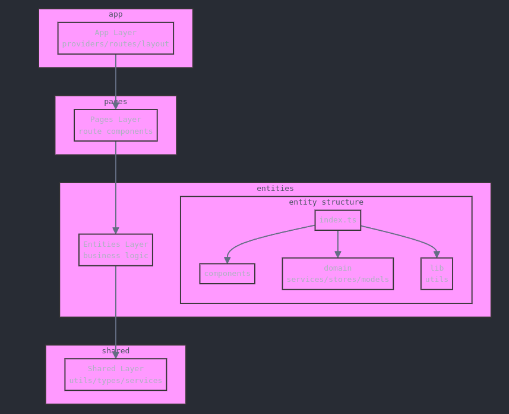

# Clean Architecture for React Projects



## Project Scale Considerations
This architecture is optimized for medium to large-scale React applications where:

Multiple teams need to work simultaneously
The business domain is complex enough to benefit from clear boundaries
The application requires scalable state management
Clear separation of concerns is crucial for maintainability

**For small single-page applications or simple projects, this architecture might introduce unnecessary complexity. In such cases, a simpler structure without strict layer separation might be more appropriate.**

## Core Principles

### Layer Separation
- **App**: App entry point , config , providers , routers etc
- **Entities**: Core business logic and domain-specific features
- **Shared**: Common utilities, types, and services
- **Pages**: Route-based components and layouts

### Import Rules

#### App Layer
- Can import from:
    - Shared layer
    - Pages layer
- Cannot import from:
    - Entities
#### Entity Layer
- Can import from:
    - Other entities (only through their public API)
    - Shared layer
    - App layer
- Cannot import from:
    - Pages layer
    - Internal modules of other entities

#### Page Layer
- Can import from:
    - Any layer
- Should compose features from entities

#### Shared Layer
- Can import from:
    - Only within shared layer
    - App layer
- Cannot import from:
    - Entities
    - Pages


### Entity Structure
```
entities/
└── entity-name/
    ├── ui/     # UI Components
    ├── domain/        # Business Logic
    │   ├── services/
    │   ├── stores/
    │   └── models/
    ├── lib/          # Entity-specific utilities
    └── index.ts      # Public API
```

### Public API Guidelines

Each entity should expose its public interface through `index.ts`:

```typescript
// entities/entity-name/index.ts
// Export only what should be available to other entities
export * from './components/PublicComponent';
export * from './domain/models/types';
export * from './domain/stores/EntityStore';
// DO NOT export internal utilities or implementation details
```

## Best Practices

### 1. Entity Independence
- Each entity should be self-contained
- Minimize dependencies between entities
- Use shared layer for common functionality

### 2. Import Standards
- Always use absolute imports with aliases
- Import only through public API
- Follow consistent import order

### 3. Component Sharing
- Keep shared components in UI layer
- Entity-specific components stay in entity
- Use composition over direct imports

### 4. Store Management
- Each entity manages its own state
- Use stores for complex state
- Share state through public API

## Examples

### ✅ Correct Usage

```typescript
// Good - Importing through public API
import { EntityFeature } from '@/entities/entity-name';
import { formatDate } from '@/shared/utils';
import { Button } from '@/ui/components';

// Good - Page composition
import { EntityFeature } from '@/entities/entity-name';
import { AnotherFeature } from '@/entities/another';

// Good - Shared utility
import { logger } from '@/shared/utils';
```

### ❌ Incorrect Usage

```typescript
// Bad - Importing internal entity modules
import { SomeComponent } from '@/entities/entity-name/components';

// Bad - Entity importing from pages
import { PageComponent } from '@/pages/some-page';

// Bad - Shared importing from entity
import { EntityUtil } from '@/entities/entity-name';
```